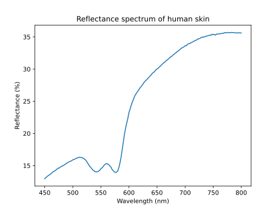

.. ****************************** Begin license ********************************
.. Copyright (C) Laboratory of Imaging technologies,
..               Faculty of Electrical Engineering,
..               University of Ljubljana.
..
.. This file is part of PyXOpto.
..
.. PyXOpto is free software: you can redistribute it and/or modify
.. it under the terms of the GNU General Public License as published by
.. the Free Software Foundation, either version 3 of the License, or
.. (at your option) any later version.
..
.. PyXOpto is distributed in the hope that it will be useful,
.. but WITHOUT ANY WARRANTY; without even the implied warranty of
.. MERCHANTABILITY or FITNESS FOR A PARTICULAR PURPOSE. See the
.. GNU General Public License for more details.
..
.. You should have received a copy of the GNU General Public License
.. along with PyXOpto. If not, see <https://www.gnu.org/licenses/>.
.. ******************************* End license *********************************

.. include:: ../../common.rst

.. _example-reflectance-spectrum-skin:

Reflectance spectrum simulations of human skin
==============================================

This example (available in `examples/mcml/reflectance_spectrum_skin`) shows how to simulate a reflectance spectrum of a simple two-layered human skin comprising epidermis and dermis. The reflectance is acquired with an integrating sphere. Note that the number of skin layers and their optical properties can be changed as desired. Moreover, the reflectance detection scheme can be changed from an integrating sphere to other types of detectors such as optical fiber probes.

Importing the required modules and submodules
---------------------------------------------

We import the submodule :py:mod:`xopto.mcml.mc` which enables an interface to a selection of sources, detectors, the Monte Carlo simulator, etc. The submodule :py:mod:`xopto.cl.clinfo` comprises helper functions for dealing with OpenCL computational devices. The submodules :py:mod:`xopto.materials.absorption.oxyhem` and :py:mod:`xopto.materials.absorption.deoxyhem` are imported for calculations of blood absorption coefficients which we will require for definition of absorption in human skin. Finally, we import the standard modules :py:mod:`numpy` and :py:mod:`matplotlib.pyplot` for mathematical functions and plotting.

.. code-block:: python

    from xopto.mcml import mc
    from xopto.cl import clinfo
    from xopto.materials.absorption import oxyhem, deoxyhem

    import numpy as np
    import matplotlib.pyplot as pp

Computational device
--------------------

Select the desired OpenCL computational device. (see also :ref:`opencl-devices-label`).

.. code-block:: python

    cl_device = clinfo.gpu(platform='nvidia')

.. note::

    In this example we have selected the first computational device listed under the Nvidia platform. The string should be changed according to the installed hardware devices.

Definition of simulation parameters and skin optical properties
---------------------------------------------------------------
Below we define parameters related to the simulation properties and optical and structural properties of skin layers. The parameter :code:`nphotons` denotes the number of photon packets launched for each simulation, while the parameter :code:`wavelengths` provides an array of wavelength points at which reflectance is simulated.

.. code-block:: python

    nphotons = 1e6
    wavelengths = np.arange(450e-9, 801e-9, 2e-9)

The properties of the epidermis (first) and dermis (second) layer are thickness :code:`d1` and :code:`d2`, refractive index :code:`n1` and :code:`n2`, melanin volume fraction :code:`m`, anisotropy factor :code:`g1` and :code:`g2`, blood volume fraction :code:`bl`, blood oxygenation :code:`oxy`, Henyey-Greenstein scattering phase functions :code:`pf1` and :code:`pf2`, absorption coefficients :code:`mua1` and :code:`mua2`, and, finally, scattering coefficients :code:`mus1` and :code:`mus2`.

The absorption coefficients for epidermis and dermis can be calculated according to a simple model given by Steven Jacques that can be accessed through `Skin Optics Summary <https://omlc.org/news/jan98/skinoptics.html>`_. The epidermis absorption coefficient :code:`mua1` of epidermis depends on the melanin volume fraction :code:`m` and is in the code given by a :code:`lambda` function enabling a call at each wavelegth. The absorption is given by:

.. math::
    
    \mu_{a1}(\lambda) = m \; 6.6 \cdot 10^{13} \; (10^9\;\lambda)^{-3.33} + (1-m) \; 10^2 \; (0.244 + 85.3 \; e^{(10^9\;\lambda - 154)/66.2})  \;[m^{-1}]

.. note::

    Units of length must be in meters!

The epidermis scattering coefficient :code:`mus1` is given by the below formula and is again used in the script as a lambda function to enable calls by different wavelengths.

.. math::
    
    \mu_{s1}(\lambda) = (2 \cdot 10^7 \; (10^9\;\lambda)^{-1.5} + 2 \cdot 10^{14}\;(10^9\;\lambda)^{-4})/(1-g_1)  \;[m^{-1}]

The dermis absoprtion coefficient :code:`mua2` is given by a combination of oxygenated and deoxygenated blood and depends on the blood volume fraction :code:`bl` and level of blood oxygenation :code:`oxy`. The blood absorption spectra are stored in :code:`mua_oxy` and :code:`mua_deoxy` variables, which are instances of the classes :py:class:`~xopto.materials.absorption.oxyhem.OxyHem` and :py:class:`~xopto.materials.absorption.deoxyhem.DeOxyHem` that offer calculation and interpolation of blood absorption coefficient for arbitrary wavelengths within a valid range. The returned absorption coefficients are in units 1/m.

.. math::
    
    \mu_{a2}(\lambda) = bl \; (oxy\; \mu_{a,oxy} + (1-oxy)\; \mu_{a,deoxy}) + 
        (1-bl) \; 10^2 \; (0.244 + 16.82 \; e^{(10^9\;\lambda - 400)/80.5})

The dermis scattering coefficient :code:`mus2` is assumed the same as in epidermis.

.. math::
    
    \mu_{s2}(\lambda) = (2 \cdot 10^7 \; (10^9\;\lambda)^{-1.5} + 2 \cdot 10^{14}\;(10^9\;\lambda)^{-4})/(1-g_2)  \;[m^{-1}]

Refer to the code below for specific values of the parameters.

.. code-block:: python

    # layer 1 - EPIDERMIS
    d1 = 100e-6  # layer thickness in m
    n1 = 1.4  # refractive index
    m = 0.02  # melanin volume fraction
    g1 = 0.8  # anisotropy factor constant with wavelength
    pf1 = mc.mcpf.Hg(g1)  # Henyey-Greenstein scatterin phase function

    # epidermis absortpion coefficient
    mua1 = lambda wavelength: m * 6.6*1e13*(1e9*wavelength)**-3.33 + \
        (1-m) * 1e2*0.5*(0.244 + 85.3*np.exp(-(1e9*wavelength - 154)/66.2))

    # epidermis scattering coefficient
    mus1 = lambda wavelength: (2*1e7*(1e9*wavelength)**-1.5 + \
        2*1e14*(1e9*wavelength)**-4) / (1-g1)

    # layer 2 - DERMIS
    d2 = 10e-3  # layer thickness in m
    n2 = 1.4  # refractive index
    bl = 0.02  # blood volume fraction
    oxy = 0.90  # oxygenation
    g2 = 0.8  # anisotropy factor
    pf2 = mc.mcpf.Hg(g2)  # Henyey-Greenstein scatterin phase function

    # dermis absorption coefficient
    mua_oxy = oxyhem.OxyHem()
    mua_deoxy = deoxyhem.DeOxyHem()

    mua2 = lambda wavelength: bl * (oxy * mua_oxy(wavelength, None) + \
        (1-oxy) * mua_deoxy(wavelength, None)) + \
        (1-bl) * 1e2 * (0.244 + 16.82*np.exp(-(1e9*wavelength - 400) / 80.5))

    # dermis scattering coefficient
    mus2 = lambda wavelength: (2*1e7*(1e9*wavelength)**-1.5 + \
        2*1e14*(1e9*wavelength)**-4) / (1-g2)
        
The layer stack
---------------
Each layer is an instance of :py:class:`~xopto.mcml.mclayer.layer.Layer` with optical properties as specified above. Note that the absorption and scattering coefficients have to be updated at each iteration through the wavelengths given by the :code:`wavelengths` parameter. All of the layers are passed as a :code:`list` to the :py:class:`~xopto.mcml.mclayer.Layers` constructor. The topmost and bottommost layers correspond to the surrounding media above and below the two-layered skin. Therefore, in total 4 layers are provided in an ascending order along the positive z axis, which points into the medium.

.. code-block:: python

    layers = mc.mclayer.Layers([
        mc.mclayer.Layer(d=0.0, n=1.0, mua=0.0, mus=0.0, pf=pf1),
        mc.mclayer.Layer(d=d1, n=n1, mua=1.0e2, mus=1.0e2, pf=pf1),
        mc.mclayer.Layer(d=d2, n=n2, mua=1.0e2, mus=1.0e2, pf=pf2),
        mc.mclayer.Layer(d=0.0, n=1.0, mua=0.0, mus=0.0, pf=pf1),
    ])

Source
------
Source is an instance of :py:class:`~xopto.mcml.mcsource.line.Line` and is defined as a pencil beam situated at the origin and perpendicularly oriented to the layered turbid medium.

.. code-block:: python

    source = mc.mcsource.Line(
        position=(0.0, 0.0, 0.0),
        direction=(0.0, 0.0, 1.0)
    )

Detector
--------
The reflectance in this example is acquired with an integrating sphere that accumulates all of the photon packets within a certain radius. We assume an integrating sphere with a 1 cm diameter opening, which is in the code provided by the parameter :code:`sp_r`. For the purpose of detecting only photons within a certain radius, we construct a radial accumulator spanning from 0 to :code:`2*sp_r` with 2 radial bins. Each radial bin is therefore the width of :code:`sp_r`. We selected two bins because the last bin collects all the photon packets that exited the turbid medium, even the ones beyond the last bin. The radial accumulator constructor :py:class:`~xopto.mcml.mcdetector.radial.Radial` accepts an instance of :py:class:`~xopto.mcbase.mcutil.axis.RadialAxis`, which stores the radial axis positions and related information of the accumulator bins. The radial accumulator :py:class:`~xopto.mcml.mcdetector.radial.Radial` is then passed to the simulator detector :py:class:`~xopto.mcml.mcdetector.base.Detectors` as a top detector via the :code:`top` keyword argument.

.. code-block:: python

    sp_r = 0.5e-2  # integrating sphere opening in m
    detector_top = mc.mcdetector.Radial(
        mc.mcdetector.RadialAxis(
            start=0.0,
            stop=2*sp_r,
            n=2)
    )
    detectors = mc.mcdetector.Detectors(
        top=detector_top
    )

The Monte Carlo simulator object and simulation runs
----------------------------------------------------
We initiliaze the Monte Carlo simulator object :py:class:`~xopto.mcml.mc.Mc` with the specified layers, source and detector objects. We also provide the desired computational device via the keyword parameter :code:`cl_devices`.To conserve with the simulations time, the photon packets that travel 10 cm away from the source are terminated by setting the maximum radius attribute :code:`rmax`.

.. code-block:: python

    mc_obj = mc.Mc(
        layers=layers, 
        source=source,
        detectors=detectors, 
        cl_devices=cl_device
    )
    mc_obj.rmax = 10e-2

Simulation runs with the above Monte Carlo simulator object have to be done at each wavelength since the absorption and reduced scattering coefficient are wavelength dependent. To store reflectance at each wavelength point, we thus define an empty numpy array :code:`reflectacne_spectrum`. Subsequently, we iterate over all the wavelengths in the :code:`for` loop changing the absorption and scattering coefficients for the epidermis and dermis layers. Finally, the simulation is run with :code:`nphotons` and only the last output parameter of the method call :py:meth:`~xopto.mcml.mc.Mc.run` which corresponds to the detectors object :py:class:`~xopto.mcml.mcdetector.base.Detectors` with separate detectors stored at the top and bottom. The reflectance as stored by the previously defined :py:class:`~xopto.mcml.mcdetector.radial.Radial` detector object can be accessed as the top detector reflectance by using the :code:`detector.top.reflectance`. Only the first accumulator corresponds to the reflectance acquired through the integrating sphere opening. Since the :py:class:`~xopto.mcml.mcdetector.radial.Radial` accumulator stores reflectance per area, we have to multiply the reflectance also by the area of the accumulator to obtain pure reflectance relative to the amount of launched photon packets. At each step :code:`i` this is then saved to the variable :code:`reflectacne_spectrum`.

Reflectance spectrum visualization
----------------------------------
The reflectance spectrum can be easily visualized using wavelengths and reflectance_spectrum arrays.

The complete example
--------------------
    
.. literalinclude:: ../../../../examples/mcml/reflectance_spectrum_skin.py

You can run this example from the root directory of the PyXOpto package as:

.. code-block:: bash

    python examples/mcml/reflectance_spectrum_skin.py
    