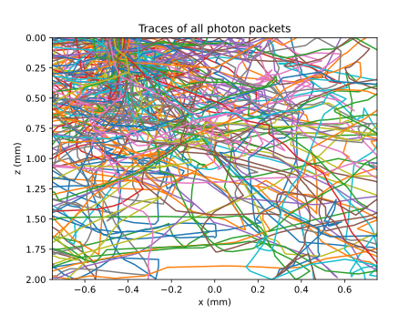

.. ****************************** Begin license ********************************
.. Copyright (C) Laboratory of Imaging technologies,
..               Faculty of Electrical Engineering,
..               University of Ljubljana.
..
.. This file is part of PyXOpto.
..
.. PyXOpto is free software: you can redistribute it and/or modify
.. it under the terms of the GNU General Public License as published by
.. the Free Software Foundation, either version 3 of the License, or
.. (at your option) any later version.
..
.. PyXOpto is distributed in the hope that it will be useful,
.. but WITHOUT ANY WARRANTY; without even the implied warranty of
.. MERCHANTABILITY or FITNESS FOR A PARTICULAR PURPOSE. See the
.. GNU General Public License for more details.
..
.. You should have received a copy of the GNU General Public License
.. along with PyXOpto. If not, see <https://www.gnu.org/licenses/>.
.. ******************************* End license *********************************

.. include:: ../../common.rst

.. _example-photon-packet-tracing:

Photon packet tracing
=====================

This example (available in `examples/mcml/tracing`) covers all the necessary steps for photon packet tracing in a two-layered turbid medium utilizing multimode optical fibers as sources and detectors.

Importing the required modules and submodules
---------------------------------------------

Firstly, we import the submodule :py:mod:`xopto.mcml.mc`, which can be conveniently used as an interface to the neccessary submodules for sources, detectors, layers, simulators, etc., the submodule :py:mod:`xopto.mcml.mcutil.fiber`, which allows utilization of multimode optical fibers and the submodule :py:mod:`xopto.cl.clinfo`, which provides functions for working with OpenCL resources, i.e. available computational devices (CPUs, GPUs, etc.). Subsequently, we import the standard modules :py:mod:`numpy` and :py:mod:`matplotlib.pyplot` for dealing with multidimensional arrays and visualization.

.. code-block:: python

    from xopto.mcml import mc
    from xopto.mcml.mcutil import fiber
    from xopto.cl import clinfo

    import numpy as np
    import matplotlib.pyplot as pp

.. note::

    Photon packet tracing can be done in the voxelated Monte Carlo model using the :py:mod:`xopto.mcvox.mc` submodule. For more information regarding the trace functionality, see :ref:`mcml-trace-label`.

Computational device
--------------------

The function :py:func:`~xopto.cl.clinfo.gpu` accepts a unique string representation of the desired computational device, which can be found via listing all of the available OpenCL devices (see :ref:`opencl-devices-label`).

.. code-block:: python

    cl_device = clinfo.gpu(device='NVIDIA GeForce')

.. note::

    In this example, we have selected NVIDIA GeForce graphics processing unit. The string should be changed to an available computation device. It is sufficient to provide only a unique part that pertains to the desired computational device.

The layer stack
---------------
Next, we define the layer stack and corresponding optical properties. The layer stack of the medium is defined through the :py:class:`~xopto.mcml.mclayer.layer.Layers` constructor, which accepts a list of :py:class:`~xopto.mcml.mclayer.layer.Layer` objects representing each individual layer. The layers are stacked along the positive direction of the z coordinate axis, which points into the medium. See :ref:`mcml-basic-example-label` or :ref:`mcml-layer-stack-label` for more information regarding the layer construction. Briefly, the topmost and bottommost layers are used only to provide the optical properties of the surrounding medium, especially to properly reflect/refract the photon packets at the boundaries. Therefore, for a two-layered turbid medium four layers have to be defined. In this example, we set the thickness of the first layer corresponding to the turbid medium to 1 |nbsp| mm and of the second layer similarly to 1 |nbsp| mm. Next, we set the refractive index to 1.33 for the first and 1.4 of the second layer. The surrounding medium refractive index is set to 1.45 to mimic the refractive index of the multimode optical fiber core. This will lead to a proper reflection/refraction at the probe-medium interface (for more complex boundary condition see example :ref:`example-reflectance-optical-probes`). The absorption and scattering coefficients are set to 1 |nbsp| 1/cm and 125 |nbsp| 1/cm for the first layer, and 2 |nbsp| 1/cm and 125 |nbsp| 1/cm for the second layer, respectively. Finally, the Henyey-Greenstein phase function is utilized in the first and second layer of the turbid medium with anisotropy factors 0.8 and 0.9, respectively.

.. code-block:: python

    layers = mc.mclayer.Layers([
        mc.mclayer.Layer(d=0.0, n=1.45, mua=0.0, mus=0.0, pf=mc.mcpf.Hg(0.0)),
        mc.mclayer.Layer(d=1e-3, n=1.33, mua=1e2, mus=125e2, pf=mc.mcpf.Hg(0.8)),
        mc.mclayer.Layer(d=1e-3, n=1.4, mua=2e2, mus=125e2, pf=mc.mcpf.Hg(0.9)),
        mc.mclayer.Layer(d=0.0, n=1.45, mua=0.0, mus=0.0, pf=mc.mcpf.Hg(0.0)),
    ])

.. note::

    All quantities MUST be provided in appropriate units, i.e., distances in m, absorption and scattering coefficients in 1/m.

Source
------
Below we define a multimode fiber source from the :py:mod:`~xopto.mcml.mcutil.fiber` submodule having a core diameter :code:`dcore` of 200 |nbsp| μm, combined diameter of core and cladding :code:`dcladding` of 220 |nbsp| μm, core refractive index :code:`ncore` of 1.45 and numerical aperture :code:`na` of 0.22. The defined multimode fiber object :py:class:`~xopto.mcbase.mcutil.fiber.MultimodeFiber` is passed to the :py:class:`~xopto.mcml.mcsource.fiber.UniformFiber` source constructor with specified parameters :code:`position` and :code:`direction`. In this case we displaced the source fiber along the :math:`x` coordinate by -440 |nbsp| μm. The source is also positioned normally to the turbid medium, which is the case by default. The uniform fiber means that the photon packets are launched into the medium uniformly over the solid angle spanned by the numerical aperture of the optical fiber. For various other source definitions check :ref:`mcml-source-label`.

.. code-block:: python

    source = mc.mcsource.UniformFiber(
        fiber=fiber.MultimodeFiber(
            dcore=200e-6, dcladding=220e-6, ncore=1.452, na=0.22
        ),
        position=(-440e-6, 0, 0),
        direction=(0.0, 0.0, 1.0)
    )

Detector
--------
We define a multimode optical fiber detector at the bottom of the turbid medium (note that other types of detectors and their position can be defined, see :ref:`mcml-detector-label`). For the multimode optical fiber detector we use the same properties as for the source fiber. The :py:class:`~xopto.mcbase.mcutil.fiber.MultimodeFiber` is subsequently passed to the :py:class:`~xopto.mcbase.mcutil.fiber.FiberLayout` constructor, which accepts the position and direction of the multimode optical fiber detector. In this case we displaced the detector fiber along the :math:`x` coordinate by 440 |nbsp| μm. A :code:`list` of :py:class:`~xopto.mcbase.mcutil.fiber.FiberLayout` objects can be passed to the :py:class:`xopto.mcml.mcdetector.probe.fiberarray.FiberArray`. However, here we use a single multimode detector. The variable :code:`detector_bottom` is subsequently passed to :py:class:`~xopto.mcml.mcdetector.base.Detectors` constructor as the :code:`bottom` keyword argument.

.. code-block:: python

    detector_bottom = mc.mcdetector.FiberArray(
        [fiber.FiberLayout(
            fiber=fiber.MultimodeFiber(
            dcore=200e-6, dcladding=220e-6, ncore=1.45, na=0.22
            ),
            position=(440e-6, 0, d1 + d2),
            direction=(0.0, 0.0, -1.0)
        ),]
    )
    detectors = mc.mcdetector.Detectors(
        bottom=detector_bottom
    )

Trace
-----
Firstly, we define the total number of launched photon packets :code:`nphotons`, which should be sufficiently small not to overflow the memory. Secondly, we define the number of recorded traces :code:`recorded_traces`, which comes into play when photon packet traces are filtered and only selected ones satisfy the criterion. In such a case, it can occur that only a small number of photon packets are traced within a single Monte Carlo run and therefore multiple runs are required to satisfy the number of photon packets traces to amount to at least :code:`recorded_traces`. Finally, the maximum expected number of events :code:`number_of_events` along each photon packet trace has to be specified beforehand. This number depends on the source-detector position and optical properties. Ideally, one should run the photon packet with as high :code:`number_of_events` as possible and do an analysis of the traces. In case the photon packets undergo significantly less events that specified initially with :code:`number_of_events`, the latter can be reduced to conserve with the memory.

.. code-block:: python

    nphotons = 10000
    recorded_traces = 100
    number_of_events = 500

In this example we utilize two :py:class:`~xopto.mcbase.mctrace.Trace` objects. The first :code:`trace_no_filter` stores all of the photon packets launched from the source multimode optical fiber, while the second :code:`trace_filter` stores only the photon packets that were detected in the detector multimode optical fiber specified through a filter object :py:class:`~xopto.mcbase.mctrace.Filter`. The filter object accept various parameters and the reader should refer to the :ref:`mcml-trace-label` for a more detailed description. In this example, the goal is to detect photon packets that are detected through the detector fiber at the bottom of the turbid medium. Therefore, the :code:`z` parameter, which corresponds to the interval of the :math:`z` coordinate at which the photon packet was terminated, is set to the thickness of the turbid medium :code:`d1 + d2` with a small offset by 1 nm on both sides of the bottom boundary. The final direction of the detected photon packet should be within the acceptance angle of the multimode detector optical fiber. Since the photon packet is detected within the optical fiber (it has passed through the the bottom boundary), the acceptance angle is :math:`\arcsin{(0.22/1.45)}` and the :math:`z` direction of the photon packet should therefore be between :math:`\cos{(\arcsin{(0.22/1.45)})}` and :math:`1`. Finally, the radius within which the photon packet final position can be provided with a :math:`(r_1,r_2, (x_0,y_0))`, where :math:`r_1` and :math:`r_2` represent radius interval and :math:`x_0` and :math:`y_0` represent the displacement of the ring. In this case the radius should correspond to the radius of the fiber core and the displacement should correspond to the displacement of the multimode detector fiber.

.. code-block:: python

    # without filter
    trace_no_filter = mc.mctrace.Trace(
        maxlen=number_of_events, options=mc.mctrace.Trace.TRACE_ALL,
    )

    # using default simulator data types
    eps = mc.mctypes.McDataTypes.eps

    # with filter
    filter = mc.mctrace.Filter(
        z=(d1 + d2 - eps, d1 + d2 + eps), 
        pz=(np.cos(np.arcsin(0.22/1.45)), 1.00),
        r=(0, 100e-6, (440e-6, 0))
    )
    trace_filter = mc.mctrace.Trace(
        maxlen=number_of_events, options=mc.mctrace.Trace.TRACE_ALL, 
        filter=filter
    )

The Monte Carlo simulator object
--------------------------------
In the following, we define two simulator objects :py:class:`~xopto.mcml.mc.Mc`, which are constructed with the same parameters differing only in the input trace objects corresponding to the :code:`trace_no_filter` and :code:`trace_filter`. The :py:class:`~xopto.mcml.mc.Mc` constructor accepts the defined :code:`layers`, :code:`source`, :code:`detectors` and computational device context :code:`cl_device`. Note that for each simulator object we also set the termination radius attributed :py:attr:`~xopto.mcml.mc.Mc.rmax` of 1 cm. In this case, the photon packets are not propagated beyond the 1 cm radius, which usually also speeds up the simulation times.

.. code-block:: python

    # without filter
    mc_obj_no_filter = mc.Mc(
        layers=layers, 
        source=source,
        detectors=detectors,
        trace=trace_no_filter, 
        cl_devices=cl_device
    )
    mc_obj_no_filter.rmax = 1e-2

    # with filter
    mc_obj_filter = mc.Mc(
        layers=layers, 
        source=source,
        detectors=detectors,
        trace=trace_filter, 
        cl_devices=cl_device
    )
    mc_obj_filter.rmax = 1e-2

Running the Monte Carlo simulations
-----------------------------------

Finally, we can run the simulator instance with a given number of photon
packets :code:`nphotons`. The :py:meth:`~xopto.mcml.mc.Mc.run` returns a :code:`list` of trace, fluence and detector objects. The traces are stored in the trace objects, thus the trace is stored as the second item :code:`trace_no_filter = output[0]`. As already described above, the simulation runs with filtered traces can result in a significantly reduced number of traces and the simulations have to be run multiple times to satisfy the desired number of the recorded traces :code:`recorded_traces`. This is done via a :code:`while` loop, where at each iteration the number of photon packet traces :code:`len(output[0])` is compared to the :code:`recorded_traces`. Note that the second axis :code:`output[0].data.shape[1]` corresponds to the :code:`number_of_events` set by :code:`maxlen`. Within the :code:`while` loop, we also utilize a collection option of the :py:meth:`~xopto.mcml.mc.Mc.run` function, which accepts the returned list of trace, fluence and detector objects :code:`output` and subsequently appends the data to it from a new simulation run.

.. code-block:: python

    # without filter
    output = mc_obj_no_filter.run(nphotons, verbose=True)
    trace_no_filter = output[0]

    # with filter
    output = None
    while output is None or len(output[0]) < recorded_traces:
        output = mc_obj_filter.run(nphotons, verbose=True, out=output)
        print('Photon packet traces collected:', len(output[0]))
    trace_filter = output[0]

Trace processing and visualization
----------------------------------

The photon packet traces can easily be visualized using :py:mod:`matplotlib.pyplot` submodule. In this example, we plot the first number of traces according to :code:`recorded_traces`, which was set to 100. Each trace is plotted using the :code:`for` loop iterating through the first 100 traces. The traces are plotted in the X-Z plane. The :math:`x` positions of the events for a single photon packet trajectory can be accessed through a keyword, e.g. :code:`trace_no_filter.data['x']`. Likewise for :math:`z` positions or any other recorded properties (see :ref:`mcml-trace-label`). The first axis/index corresponds to photon packet traces, the second axis/index corresponds to the recorded events. It should be noted that each trace can have a different number of recorded events and the trace should be plotted only to the last recorded event before termination. This number is provided for each photon packet trace by the property :py:attr:`~xopto.mcbase.mctrace.Trace.n` of the object :py:class:`~xopto.mcbase.mctrace.Trace`. Note that the positions are originally in meters and are in this example converted to millimeters by multiplying with 1000.

.. image:: ../../images/examples/mcml/tracing/trace_fig2.svg
   :height: 480 px
   :width: 640 px
   :scale: 75 %
   :alt: Traces of filtered photon packets
   :align: center

The complete example
--------------------
    
.. literalinclude:: ../../../../examples/mcml/tracing.py

You can run this example from the root directory of the PyXOpto package as:

.. code-block:: bash

    python examples/mcml/tracing.py
    