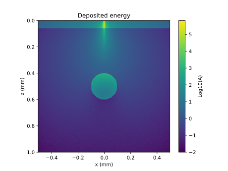
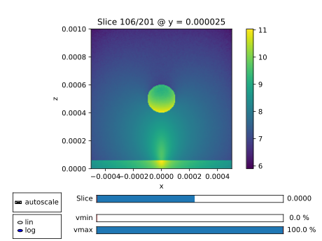

.. ****************************** Begin license ********************************
.. Copyright (C) Laboratory of Imaging technologies,
..               Faculty of Electrical Engineering,
..               University of Ljubljana.
..
.. This file is part of PyXOpto.
..
.. PyXOpto is free software: you can redistribute it and/or modify
.. it under the terms of the GNU General Public License as published by
.. the Free Software Foundation, either version 3 of the License, or
.. (at your option) any later version.
..
.. PyXOpto is distributed in the hope that it will be useful,
.. but WITHOUT ANY WARRANTY; without even the implied warranty of
.. MERCHANTABILITY or FITNESS FOR A PARTICULAR PURPOSE. See the
.. GNU General Public License for more details.
..
.. You should have received a copy of the GNU General Public License
.. along with PyXOpto. If not, see <https://www.gnu.org/licenses/>.
.. ******************************* End license *********************************

.. include:: ../../common.rst

.. _example-voxelized-vessel:

Voxelized Monte Carlo simulations
=================================

In this example we simulate the deposited energy in a voxelized two-layered skin model comprising epidermis and dermis with an embedded blood vessel. 

Importing the required modules and submodules
---------------------------------------------
From :code:`xopto.mcvox` we import the module :py:mod:`~xopto.mcvox.mc`, which enables an interface to Monte Carlo voxelized simulations, definitions of voxel grids, fluence accumulators, materials and so on, from :code:`xopto.mcvox.mcutil` we import module :py:mod:`xopto.mcvox.mcutil.axis`, which allows axes definitions for voxels and fluence accumulators and finally, we import the module :py:mod:`xopto.cl.clinfo` from :code:`xopto.cl` for computational device definition. Additionally, we require modules :py:mod:`numpy` and :py:mod:`matplotlib.pyplot` for mathematical functions and visualization.

.. code-block:: python

    from xopto.mcvox import mc
    from xopto.mcvox.mcutil import axis
    from xopto.cl import clinfo

    import numpy as np
    import matplotlib.pyplot as pp

Computational device
--------------------

In this section we select the desired OpenCL computational device (see also :ref:`opencl-devices-label`).

.. code-block:: python

    cl_device = clinfo.gpu(platform='nvidia')

.. note::

    In this example we have selected the first computational device listed under the Nvidia platform. The string should be changed according to the installed hardware devices.

Voxel grid and tissue structure
-------------------------------------------------
For the definition of the voxel grid, we firstly define the number of bins in each axis direction :code:`nx`, :code:`ny` and :code:`nz`. We chose odd number of bins :code:`nx` and :code:`ny` in order to have the center of the central voxel at :math:`x=0.0` and :math:`y=0.0`. Using the :py:class:`~xopto.mcbase.mcutil.axis.Axis` constructor, we define the axes in x, y and z direction. These are defined in a way that there is an equal number of voxels on each side of the origin in the x and y direction and a single central voxel. Note that the leftmost and rightmost edges are provided as keyword arguments :code:`start` and :code:`stop` and that the rightmost edge is included in the provided interval. The keyword parameter :code:`n` provides the number of bins. The voxel object is then defined using the :py:class:`~xopto.mcvox.mcgeometry.voxel.Voxels` contructor by passing the axes.

.. code-block:: python

    # number of bins and size
    nx = 201
    ny = 201
    nz = 200
    binsize = 5e-6

    # define each axis
    xaxis = axis.Axis(
        start=-nx/2 * binsize, 
        stop=nx/2 * binsize, 
        n=nx
    )

    yaxis = axis.Axis(
        start=-ny/2 * binsize, 
        stop=ny/2 * binsize, 
        n=ny
    )

    zaxis = axis.Axis(
        start=0.0, 
        stop=nz * binsize,
        n=nz
    )

    # define voxels
    voxels = mc.mcgeometry.Voxels(
        xaxis=xaxis, 
        yaxis=yaxis, 
        zaxis=zaxis
    )

Once the voxels are defined, we can set the structure of the tissue. This can be easily done by logical indexing that is readily available within the :py:mod:`numpy` library. Firstly, we can obtain x, y, z coordinate matrices or a mesh by calling a :py:class:`~xopto.mcvox.mcgeometry.voxel.Voxels.meshgrid` method. These can then be used to impose geometrical logical conditions under which we can specify optical properties only to selected voxels. In this example, the tissue will resemble human skin comprising epidermis, dermis and a blood vessel. The blood vessel can be desribed by a cylinder of radius :code:`r_vessels` equal to  100 |nbsp| μm placed along the y axis at :code:`x0` and :code:`z0`. The depth :code:`z0` is at half of the total thickness of the voxelized medium in z direction.

Subsequently, we define logical matrices of the same shape and size as the voxelized medium mesh. The matrix of logical indices :code:`logical_epi` corresponds to the epidermis and has :code:`True` values only for z coordinates lower than 60 |nbsp| μm, :code:`logical_der` corresponds to the dermis having :code:`True` values beyond 60 |nbsp| μm. Finally, the matrix of logical indices :code:`logical_vessel` contains logical :code:`True` values within the cylinder representing the blood vessel. These logical matrices will be utilized to assign the optical properties later in this example.

.. code-block:: python

    # get mesh
    z, y, x = voxels.meshgrid()

    # set logical indices for material assignment
    r_vessels = 100e-6
    x0 = 0.0
    z0 = nz/2 * binsize

    logical_epi = z <= 60e-6
    logical_der = z > 60e-6
    logical_vessel = (x-x0)**2 + (z-z0)**2 <= r_vessels**2

Materials
---------
Each material that will be utilized within the structured tissue can be constructed using the :py:class:`~xopto.mcvox.mcmaterial.material.Material` class, which accepts refractive index :code:`n`, absorption coefficient :code:`mua` in 1/m, scattering coefficient :code:`mua` in 1/m and scattering phase function. Various scattering phase functions that are available in the package :py:mod:`xopto.mcbase.mcpf` can be chosen. In this case we select Henyey-Greenstein phase function for all materials. We define optical properties for surrounding medium :code:`material_sm`, epidermis :code:`material_epi`, dermis :code:`material_der` and blood :code:`material_bl`. These values were obtained from the Steven Jacques' example for `mcxyz <https://omlc.org/software/mc/mcxyz/index.html>`_ under the section How to use mcxyz.c. Finally, it should be noted that the defined materials have to be packed by using the :py:class`~xopto.mcvox.mcmaterial.material.Materials` constructor, which accepts a :code:`lsit` of :py:class:`~xopto.mcvox.mcmaterial.material.Material` objects and is later in this example passed to the Monte Carlo simulator constructor :py:class:`~xopto.mcvox.mc.MC`. Note that the order of the :py:class:`~xopto.mcvox.mcmaterial.material.Material` objects is important, since voxels will be assigned indices that correspond to the order of these materials in the list. Initially, all voxels are assigned an index 0, which corresponds to the first material or in our case the surrounding medium :code:`material_sm`. The proper material assignment to each voxel will be done later in this example.

.. code-block:: python

    # surrounding medium
    material_sm = mc.mcmaterial.Material(
        n=1.33,
        mua=0.0001e2,
        mus=1.0e2,
        pf=mc.mcpf.Hg(1.0)
    )

    # epidermis
    material_epi = mc.mcmaterial.Material(
        n=1.33,
        mua=16.5724e2,
        mus=375.9398e2,
        pf=mc.mcpf.Hg(0.9)
    )

    # dermis
    material_der = mc.mcmaterial.Material(
        n=1.33,
        mua=0.4585e2,
        mus=356.5406e2,
        pf=mc.mcpf.Hg(0.9)
    )

    # blood
    material_bl = mc.mcmaterial.Material(
        n=1.33,
        mua=230.5427e2,
        mus=93.9850e2,
        pf=mc.mcpf.Hg(0.9)
    )

    materials = mc.mcmaterial.Materials([
        material_sm,
        material_epi,
        material_der,
        material_bl
    ])

Source
------
In this example we define a pencil beam source, which can be initialized using the :py:class:`~xopto.mcvox.mcsource.line.Line` class. Two keyword parameters can be passed :code:`position` and :code:`direction`. In this case we keep the default values which describe the source position at the origin and perpendicular to the surface of the medium.

.. code-block:: python

    source = mc.mcsource.Line()

Fluence object
--------------
To accumulate either fluence or deposited energy, we have to define an instance of :py:class:`~xopto.mcbase.mcfluence.Fluence`. The :py:class:`~xopto.mcbase.mcfluence.Fluence` class accepts x, y and z axes and a mode parameter, which can be assigned a string :code:`fluence` or :code:`deposition`, depending on the desired simulated quantity stored in the fluence object. In case the mode is :code:`fluence`, the accumulated quantity is fluence with units of 1/m:superscript:`2`, under the mode :code:`deposition`, the accumulated quantity is the energy deposition in a voxel with units 1/m:superscript:`3` and normalized against the initial number of launched photon packets. To obtain physically representable energy deposition units, the accumulated values should be multiplied by the power of the source in Watts.

.. code-block:: python

    fluence = mc.mcfluence.Fluence(
        xaxis=xaxis, 
        yaxis=yaxis, 
        zaxis=zaxis,
        mode='deposition'
    )

The Monte Carlo simulator object and material assignment
--------------------------------------------------------
In this section we define the :py:class:`~xopto.mcvox.mc.MC` simulator object, which accepts various parameters and subsequently assign materials to voxels. Mandatory parameters to the :py:class:`~xopto.mcvox.mc.MC` simulator object constructor are :code:`voxels`, :code:`materials` and :code:`source`, which we have already defined in the previous sections. We also pass the fluence object :code:`fluence` to accumulate the deposited energy and also the :code:`cl_device` object to specify the computational device on which the simulations are going to be run.

Once the :py:class:`~xopto.mcvox.mc.MC` simulator object is defined, we can assign the materials to voxels. We use the previously defined logical matrices corresponding to the different tissue structures to access the voxels and assign indices that correspond to the order of materials packed in the :code:`materials` object.

.. code-block:: python

    mc_obj = mc.Mc(
        voxels=voxels,
        materials=materials,
        fluence=fluence,
        source=source,
        cl_devices=cl_device,
    )

    # assign the materials to voxels
    mc_obj.voxels.material[logical_epi] = 1
    mc_obj.voxels.material[logical_der] = 2
    mc_obj.voxels.material[logical_vessel] = 3

Running the Monte Carlo simulation
----------------------------------
To run the Monte Carlo simulations, we set the number of photons to 10:superscript:`8` and call the method :py:meth:`~xopto.mcvox.mc.MC.run`, which returns three objects. The fluence is returned as the second object, which is thus achieved by :code:`[1]`.

.. code-block:: python

    nphotons = 1e8
    deposit = mc_obj.run(nphotons, verbose=True)[1]

Visualize the results
---------------------
Finally, we visualize the obtained deposited energy, which can be accessed through the attribute :py:attr:`~xopto.mcbase.mcfluence.Fluence.data` in the returned :py:attr:`~xopto.mcbase.mcfluence.Fluence` object :code:`deposit`. The visualization is done in the logarithmic scale. Note that visualization can also be done in a straightforward manner by calling the method :py:meth:`~xopto.mcbase.mcfluence.Fluence.plot` and specifying the axis along which slices through the 3D medium are performed.

.. code-block:: python

    # plot the deposited energy in 1/m^3.
    pp.figure()
    pp.title('Deposited energy')
    extent = [1e3*(xaxis.centers[0] - binsize/2), 1e3*(xaxis.centers[-1] - binsize/2),
        1e3*(zaxis.centers[-1] + binsize/2), 1e3*(zaxis.centers[0] - binsize/2)
    ]
    pp.imshow(np.log10(deposit.data[:,100,:]/nphotons), 
        extent=extent,
        origin='upper'
    )
    pp.xlabel('x (mm)')
    pp.ylabel('z (mm)')
    cbar = pp.colorbar()
    cbar.set_label('Log10(A)')
    pp.show()

    # use the slicer view
    deposit.plot(axis='y')

The complete example
--------------------

.. literalinclude:: ../../../../examples/mcvox/voxelized_vessel.py

You can run this example from the root directory of the PyXOpto package as:

.. code-block:: bash

    python examples/mcvox/voxelized_vessel.py